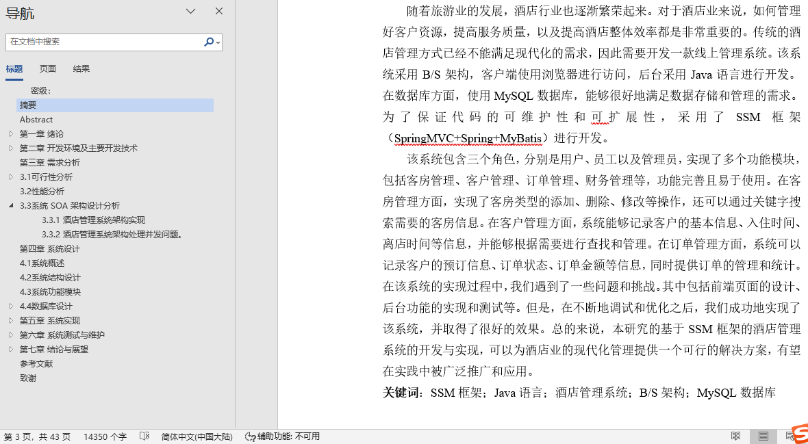
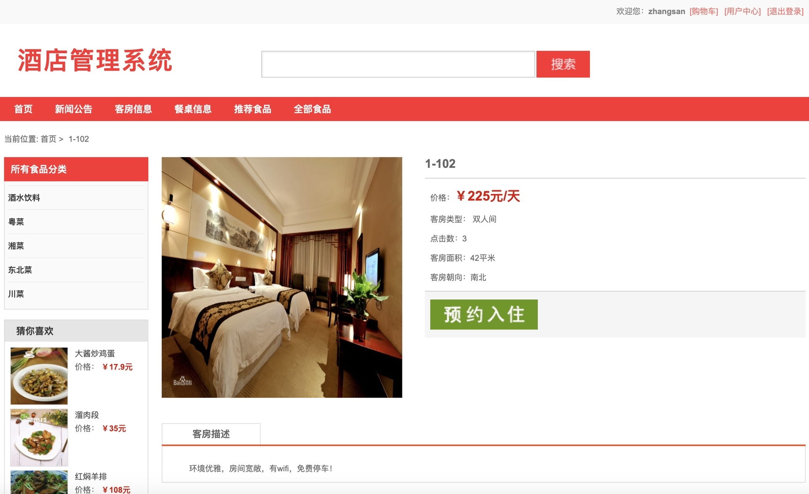
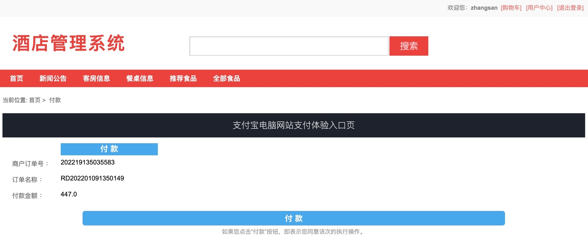
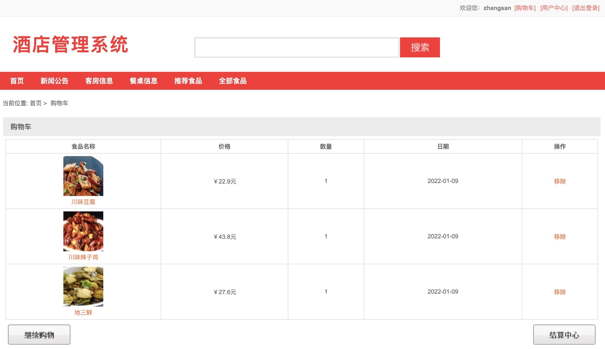
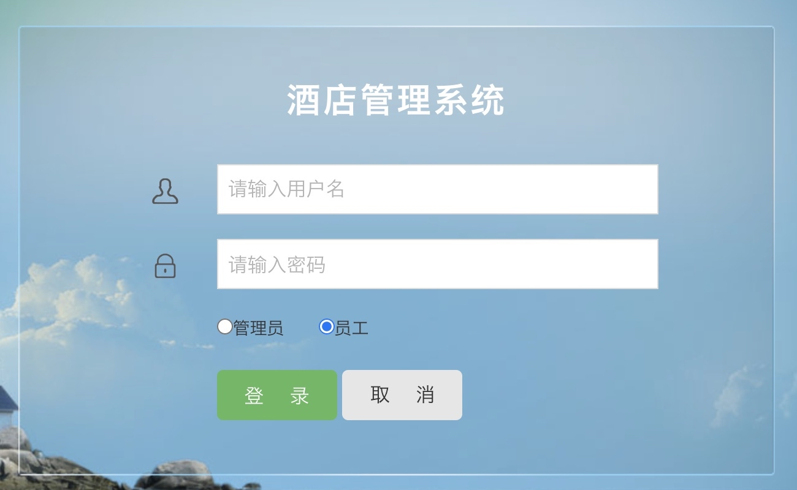
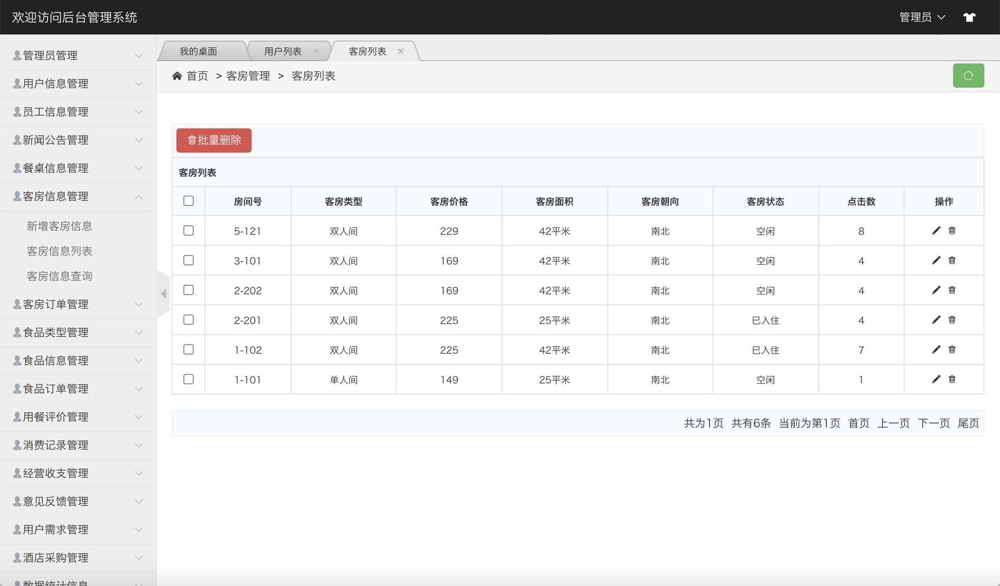
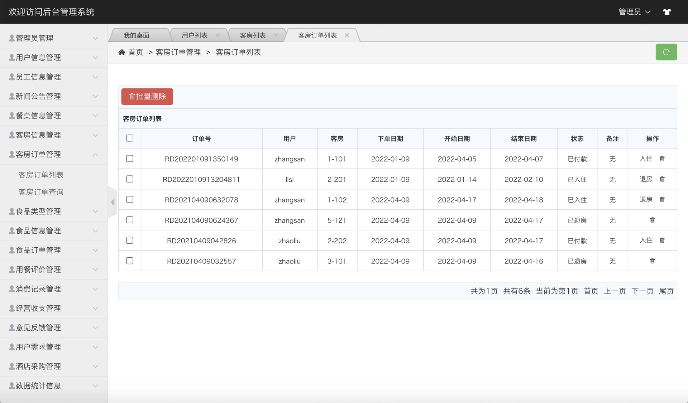
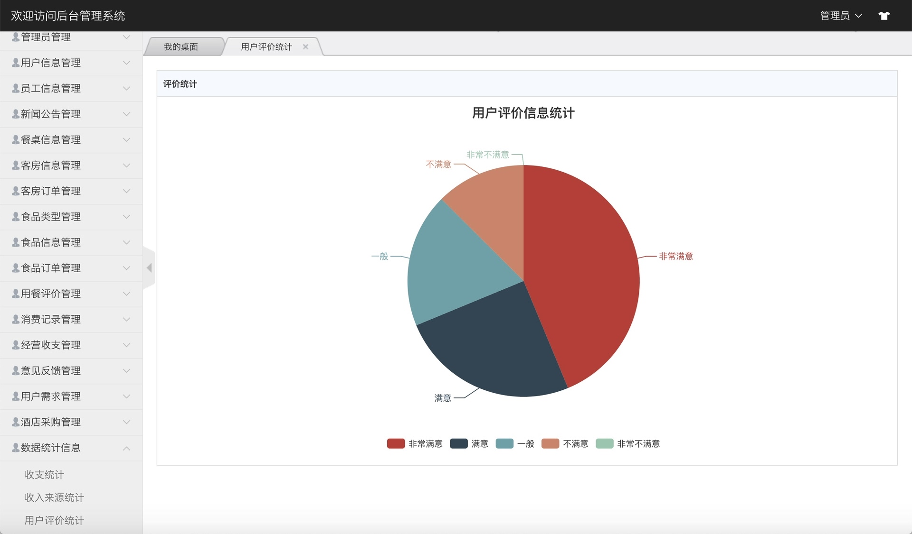
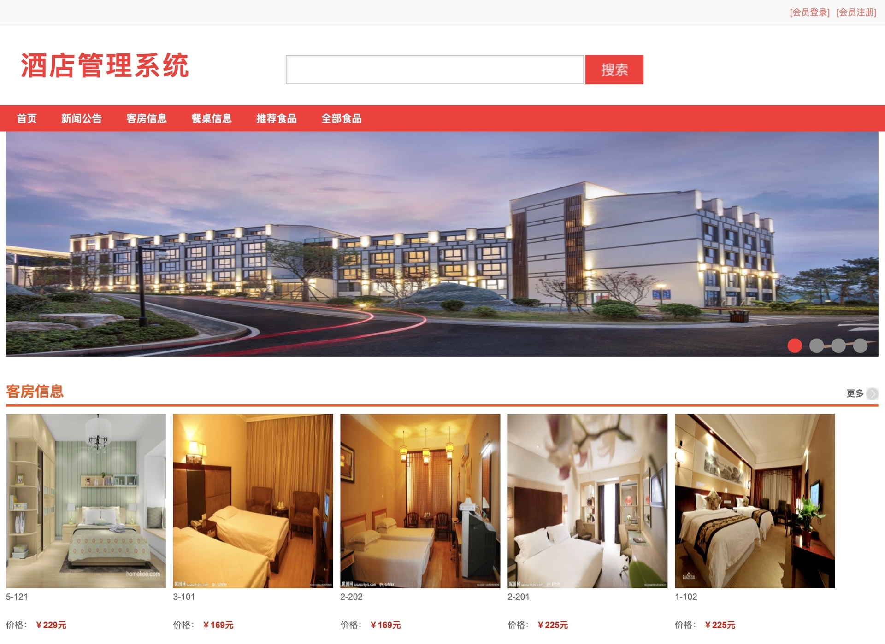
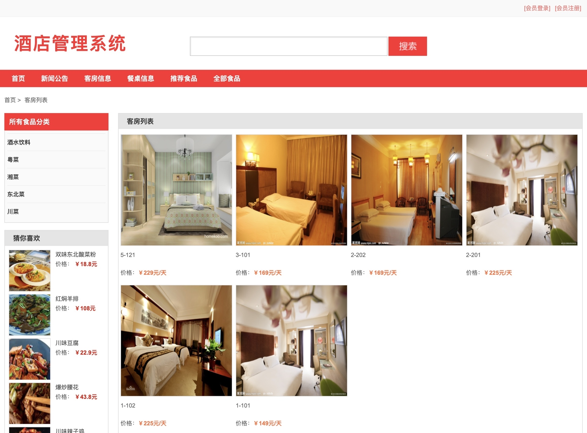

## 基于SSM框架的酒店管理系统(程序+报告)

###  获取sql数据库文件: 从戎源码网 (https://armycodes.com/) QQ: 386869957 QQ群: 377586148
###  所有系统地址: (https://github.com/YuLin-Coder/AllProjectCatalog) 
###  所有项目以及源代码本人均调试运行无问题 可支持远程安装部署调试、定制修改、代码讲解

## 项目介绍
基于SSM框架的酒店管理系统，系统主要分为前台和后台两⼤功能模块，共包含三种角色，分别是：⽤户、员⼯、管理员。
具体功能如下：
1.前台功能模块
前台⾸⻚、新闻公告、客房信息列表、客房详情展示、预约⼊住、下单⽀付、餐桌信息、⻝品信息列表、⻝品详
情展示、商品搜索、添加到购物⻋、⽤户登陆、⽤户注册、个⼈中⼼、修改个⼈信息、修改密码、我的订单、我的
需求、⽤餐评价、意⻅反馈等功能
2.后台管理模块
后台系统登陆、管理员信息管理、⽤户信息管理、员⼯信息管理、新闻公告管理、餐桌信息管理、客房信息管
理、客房订单管理、⻝品类型管理、⻝品信息管理、⻝品订单管理、⽤餐评价管理、消费记录管理、经营收⽀管
理、意⻅反馈管理、⽤户需求管理、酒店采购管理、数据统计管理等功能

## 项目技术
- 编程语言：Java
- 数据库：MySQL
- 前端技术：JSP、Jquery、H-ui
- 后端技术：Spring、SpringMVC、MyBatis

## 运行环境
- JDK版本：JDK1.8及以上
- 开发工具：IDEA、Ecplise、Myecplise都可以
- 数据库: MySQL5.7及以上

## 运行截图

